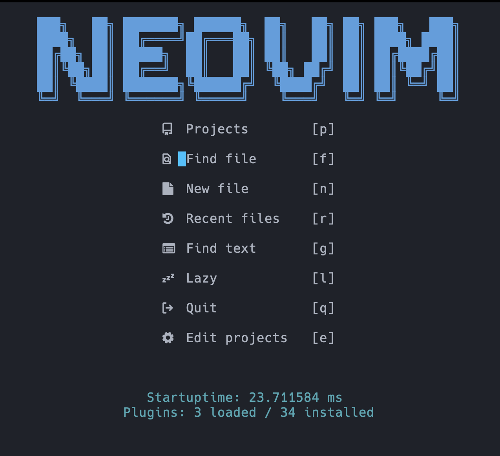

# neovim-docker
## builded from neovim source code



first run
```
docker run --name neovim -d aspushedp/neovim
```
or
```
docker run --name neovim -v my-nvim-config:/root/.config/nvim -v my-projects:/root/projects -d aspushedp/neovim
```

then every time you need nvim
```
docker exec -it neovim nvim
```
or run bash
```
docker exec -it neovim bash
```

you also can make a alias in you .bashrc or .zshrc
```
alias nvim="docker exec -it neovim nvim"
```
