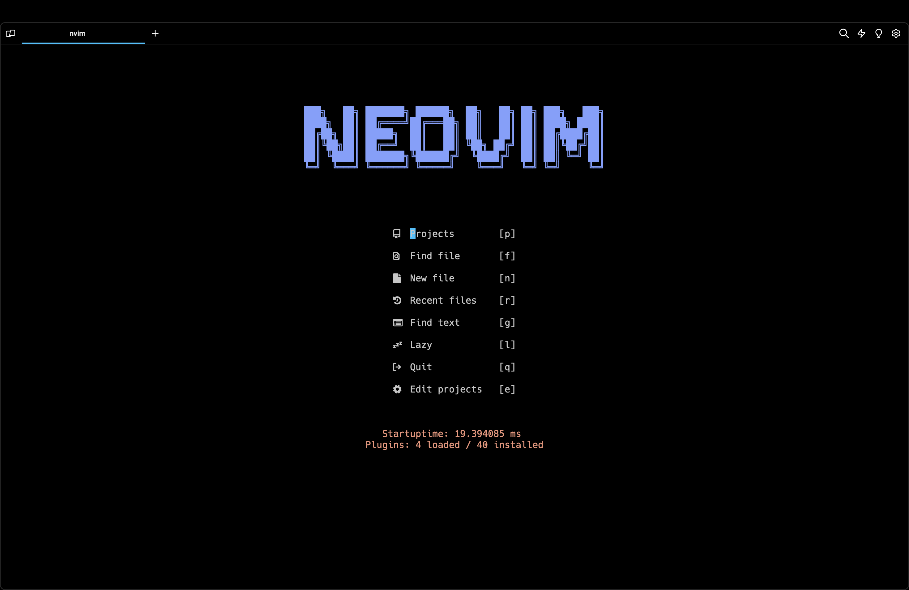
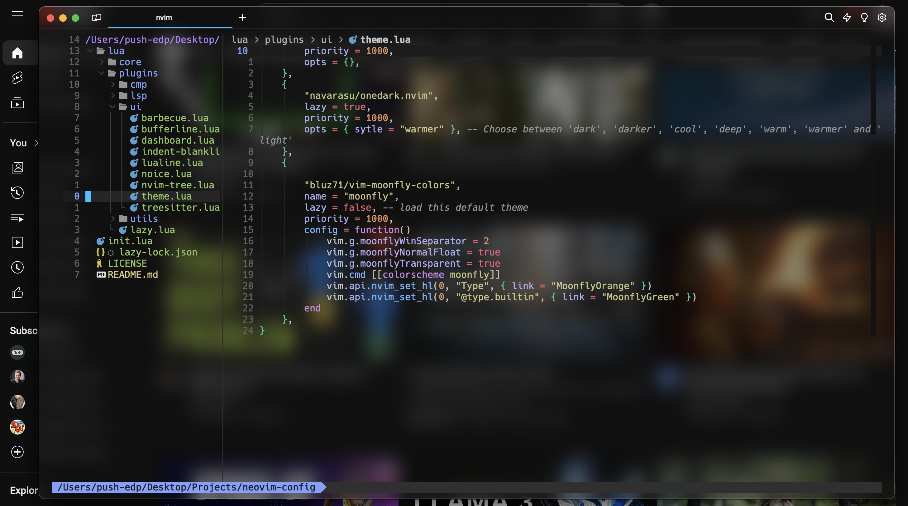

# neovim-docker
[](https://github.com/CallOrRet/neovim-docker/actions/workflows/docker-image.yml)
## Built from the Neovim source code, it natively supports both arm64 and amd64 platforms and includes a basic build environment for Neovim plugins.







## You need to install the nerd font on the host first, otherwise the icons will not be displayed.
[NerdFont](https://www.nerdfonts.com/)

To run for the first time:
```
docker run --name neovim -d callandret/neovim
```
Alternatively, if you want to mount your own config and projects:
```
docker run --name neovim -v my-nvim-config:/root/.config/nvim -v /path/my-projects:/path/my-projects -dit callandret/neovim
```
Refer to the above example images included from my Neovim config: [https://github.com/CallOrRet/neovim-config](https://github.com/CallOrRet/neovim-config)

Then, whenever you need to use Neovim:
```
docker exec -it neovim nvim
```
Or to run a bash shell:
```
docker exec -it neovim bash
```

You can also create an alias in your .bashrc or .zshrc:
```
alias nvim="docker exec -it neovim nvim"
```
